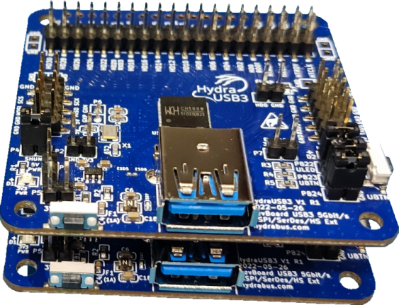

# HydraUSB3 v1 Test firmware / examples
hydrausb3_fw repository contains open source (see [LICENSE](LICENSE)) test firmware / examples for HydraUSB3 v1 devkit using WCH CH569 MCU.
* Contributor shall check [CODING_STYLE.md](CODING_STYLE.md)

For more details on HydraUSB3 see https://hydrabus.com/hydrausb3-v1-0-specifications

All examples with name HydraUSB3_DualBoard_XXX requires 2x HydraUSB3 v1 boards to be plugged together.
* First HydraUSB3 board shall have PB24 not populated (called RX mode)
* Seconds HydraUSB3 board shall have PB24 populated with a 2.54mm Jumper (called TX mode)

[wch-ch56x-bsp](https://github.com/hydrausb3/wch-ch56x-bsp) submodule contains the BSP (Board Support Package) based on WCH official code from https://github.com/openwch/ch569/tree/main/EVT/EXAM/SRC (but heavily refactored/rewritten on lot of parts)

### How to build/flash and use firmwares examples / source code for HydraUSB3(CH569 MCU)
For Linux:
 * See Wiki How to build flash and use examples on Linux with shell:
   * https://github.com/hydrausb3/hydrausb3_fw/wiki/how-to-build-flash-and-use-examples-on-linux
 * See Wiki How to build flash and use examples on Linux with Eclipse IDE:
   * https://github.com/hydrausb3/hydrausb3_fw/wiki/how-to-build-flash-and-use-examples-on-linux-(Eclipse-IDE)

For Windows(requires MSYS2/MINGW64):
 * See Wiki How to build flash and use examples on Windows with MSYS2/MINGW64 shell:
   * https://github.com/hydrausb3/hydrausb3_fw/wiki/how-to-build-flash-and-use-examples-on-windows
 * See Wiki How to build flash and use examples on Windows with Eclipse IDE:
   * https://github.com/hydrausb3/hydrausb3_fw/wiki/how-to-build-flash-and-use-examples-on-windows-(Eclipse-IDE)
